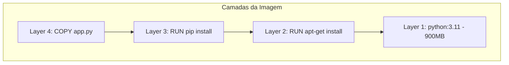

# 🎬 Vídeo 4.1 - Hardening de Dockerfile

**Aula**: 4 - Segurança de Containers  
**Vídeo**: 4.1  
**Temas**: Dockerfile inseguro vs seguro; Multi-stage build; Usuário não-root; Hadolint

---

## 🚀 Antes de Começar

### Pré-requisitos

| Requisito | Como verificar |
|-----------|----------------|
| Docker instalado | `docker --version` |
| Git instalado | `git --version` |
| Conta GitHub | Acesso ao github.com |

### Primeira vez?
→ Faça fork do repositório `fiap-dclt-devsecops-aula04` para sua conta GitHub

---

## 📚 Parte 1: Por que Containers Precisam de Hardening?

### Passo 1: Anatomia de uma Imagem Docker



**Problema**: Vulnerabilidade em QUALQUER layer = sua aplicação está vulnerável!

---

### Passo 2: Problemas Comuns em Dockerfiles

| Problema | Risco | Impacto |
|----------|-------|---------|
| Rodar como **root** | Container comprometido = host comprometido | CRÍTICO |
| Imagem base **grande** | Mais superfície de ataque | ALTO |
| **Copiar tudo** (COPY . .) | Vaza secrets, arquivos desnecessários | ALTO |
| Sem **HEALTHCHECK** | Container morto não é detectado | MÉDIO |
| **Debug** em produção | Expõe informações internas | MÉDIO |

---

### Passo 3: Glossário de Termos

| Termo | Significado |
|-------|-------------|
| **Hardening** | Processo de tornar sistema mais seguro |
| **Multi-stage build** | Dockerfile com múltiplas fases de build |
| **Non-root user** | Usuário sem privilégios de administrador |
| **Slim/Alpine** | Imagens base menores e mais seguras |
| **Distroless** | Imagens sem shell ou package manager |

---

## 🍴 Parte 2: Configurar Repositório

### Passo 4: Fork e Clone

1. Acesse: `https://github.com/josenetoo/fiap-dclt-devsecops-aula04`
2. Clique em **Fork** (ou clone diretamente)
3. Clone:

**Linux/Mac:**
```bash
cd ~/fiap-devsecops
git clone https://github.com/josenetoo/fiap-dclt-devsecops-aula04.git
cd fiap-dclt-devsecops-aula04
ls -la
```

**Estrutura esperada:**
```
fiap-dclt-devsecops-aula04/
├── app.py
├── requirements.txt
├── Dockerfile           ← Versão INSEGURA
├── Dockerfile.secure    ← Versão SEGURA
├── .hadolint.yaml       ← Config do linter
├── .checkov.yaml        ← Config do IaC scanner
├── terraform/           ← Exemplos de IaC
└── docs/
```

---

## 🔍 Parte 3: Analisar Dockerfile Inseguro

### Passo 5: Examinar Dockerfile Inseguro

**Linux/Mac:**
```bash
cat Dockerfile
```

**Conteúdo (com problemas intencionais):**
```dockerfile
# ❌ DOCKERFILE INSEGURO - NÃO USE EM PRODUÇÃO!

# Problema 1: Imagem base grande (900MB+)
FROM python:3.11

# Problema 2: Não define usuário (roda como root)

# Problema 3: Copia TUDO (inclusive .git, secrets)
COPY . /app
WORKDIR /app

# Problema 4: Instala sem cache cleanup
RUN pip install -r requirements.txt

# Problema 5: Sem HEALTHCHECK

# Problema 6: Usa servidor de desenvolvimento
CMD ["python", "app.py"]
```

---

### Passo 6: Verificar Tamanho da Imagem

**Linux/Mac:**
```bash
# Build da imagem insegura
docker build --platform linux/amd64 -t app:insecure -f Dockerfile .

# Verificar tamanho
docker images app:insecure
```

**Resultado esperado:**
```
REPOSITORY   TAG        SIZE
app          insecure   950MB   ← Muito grande!
```

---

## ✅ Parte 4: Criar Dockerfile Seguro

### Passo 7: Examinar Dockerfile.secure

**Linux/Mac:**
```bash
cat Dockerfile.secure
```

**Conteúdo (boas práticas):**
```dockerfile
# ============================================
# DOCKERFILE SEGURO - Multi-stage build
# ============================================

# ---- Stage 1: Builder ----
FROM python:3.11-slim AS builder

WORKDIR /app

# Copiar apenas requirements primeiro (melhor cache)
COPY requirements.txt .

# Instalar dependências em local do usuário
RUN pip install --user --no-cache-dir -r requirements.txt

# ---- Stage 2: Production ----
FROM python:3.11-slim AS production

# Criar usuário não-root
RUN useradd --create-home --shell /bin/bash appuser

WORKDIR /app

# Copiar dependências do builder
COPY --from=builder /root/.local /home/appuser/.local

# Copiar apenas código necessário
COPY --chown=appuser:appuser app.py .
COPY --chown=appuser:appuser templates/ ./templates/

# Mudar para usuário não-root
USER appuser

# Adicionar .local/bin ao PATH
ENV PATH=/home/appuser/.local/bin:$PATH

# Expor porta
EXPOSE 5000

# Healthcheck
HEALTHCHECK --interval=30s --timeout=10s --start-period=5s --retries=3 \
    CMD python -c "import urllib.request; urllib.request.urlopen('http://localhost:5000/health')" || exit 1

# Usar servidor de produção
CMD ["gunicorn", "--bind", "0.0.0.0:5000", "--workers", "2", "app:app"]
```

---

### Passo 8: Build e Comparar

**Linux/Mac:**
```bash
# Build da imagem segura
docker build --platform linux/amd64 -t app:secure -f Dockerfile.secure .

# Comparar tamanhos
docker images | grep app
```

**Resultado esperado:**
```
REPOSITORY   TAG        SIZE
app          insecure   950MB
app          secure     180MB   ← 5x menor!
```

---

### Passo 9: Verificar Usuário

**Linux/Mac:**
```bash
# Imagem INSEGURA - roda como root
docker run --rm app:insecure whoami
# Resultado: root ❌

# Imagem SEGURA - roda como appuser
docker run --rm app:secure whoami
# Resultado: appuser ✅
```

---

## 🔍 Parte 5: Hadolint - Linter de Dockerfile

### Passo 10: O que é Hadolint?

**Hadolint** = Linter para Dockerfiles (detecta problemas e más práticas)

**Regras comuns:**
| Regra | Descrição |
|-------|-----------|
| DL3006 | Sempre adicionar tag à imagem base |
| DL3008 | Fixar versões de pacotes apt |
| DL3013 | Fixar versões de pacotes pip |
| DL3018 | Usar --no-cache com apk |
| DL3025 | Usar JSON em CMD/ENTRYPOINT |

---

### Passo 11: Instalar Hadolint

**Linux/Mac:**
```bash
# Via Homebrew
brew install hadolint

# Verificar
hadolint --version
```

**Windows (PowerShell):**
```powershell
# Via Chocolatey
choco install hadolint

# Verificar
hadolint --version
```

---

### Passo 12: Executar Hadolint

**Linux/Mac:**
```bash
cd ~/fiap-devsecops/fiap-dclt-devsecops-aula04

# Analisar Dockerfile inseguro
hadolint Dockerfile

# Analisar Dockerfile seguro
hadolint Dockerfile.secure
```

**Resultado Dockerfile inseguro:**
```
Dockerfile:11 DL3042 warning: Avoid use of cache directory with pip. Use `pip install --no-cache-dir <package>`
```

**Resultado Dockerfile.secure:**
```
(nenhum warning)
```

---

## 🔄 Parte 6: Adicionar ao Pipeline

### Passo 13: Criar Job Hadolint

**Linux/Mac:**
```bash
cd ~/fiap-devsecops/fiap-dclt-devsecops-aula04
mkdir -p .github/workflows

cat > .github/workflows/security.yml << 'EOF'
# ============================================
# WORKFLOW: Container Security
# ============================================
name: 🔒 Container Security

on:
  push:
    branches: [main]
  pull_request:
    branches: [main]

jobs:
  # ============================================
  # JOB: Lint Dockerfile com Hadolint
  # ============================================
  hadolint:
    name: 🔍 Dockerfile Lint
    runs-on: ubuntu-latest
    
    steps:
      - name: 📥 Checkout
        uses: actions/checkout@v4

      - name: 🔍 Hadolint
        uses: hadolint/hadolint-action@v3.1.0
        with:
          dockerfile: Dockerfile.secure
          failure-threshold: warning
EOF
```

---

### Passo 14: Commit e Push

**Linux/Mac:**
```bash
git add .github/workflows/security.yml
git commit -m "feat: adicionar Hadolint ao pipeline"
git push origin main
```

---

## 🔧 Troubleshooting

| Erro | Causa | Solução |
|------|-------|---------|
| `hadolint: command not found` | Não instalado | Instalar via brew/choco |
| Build falha no multi-stage | Syntax error | Verificar `--from=builder` |
| Container não inicia | Healthcheck falha | Verificar endpoint `/health` |

---

## ✅ Checkpoint

Ao final deste vídeo você deve ter:

- [ ] Entender problemas de Dockerfiles inseguros
- [ ] Conhecer multi-stage build
- [ ] Dockerfile.secure buildado (5x menor)
- [ ] Verificar que roda como non-root
- [ ] Hadolint instalado e executado
- [ ] Job Hadolint no pipeline

---

**FIM DO VÍDEO 4.1** ✅
