# 🎬 Vídeo 4.2 - Scan de Imagens Docker

**Aula**: 4 - Segurança de Containers  
**Vídeo**: 4.2  
**Temas**: Trivy Image Scan; Vulnerabilidades em imagens; ECR Scan; Bloquear deploy de imagens vulneráveis

---

## 📚 Parte 1: Por que Escanear Imagens?

### Passo 1: Dockerfile Seguro ≠ Imagem Segura

```mermaid
graph TB
    A[Dockerfile.secure] --> B[Build]
    B --> C[Imagem Final]
    
    D[Imagem Base python:3.11-slim] --> C
    E[Dependências pip] --> C
    F[Pacotes do sistema] --> C
    
    C --> G{Scan}
    G -->|CVEs encontrados| H[❌ Vulnerável]
    G -->|Sem CVEs| I[✅ Segura]
```



**Problema**: Mesmo com Dockerfile perfeito, a imagem pode ter:
- CVEs na imagem base
- CVEs nas dependências Python
- CVEs em pacotes do sistema

---

### Passo 2: Superfície de Ataque

| Componente | Exemplo | CVEs possíveis |
|------------|---------|----------------|
| **Imagem base** | python:3.11-slim | OpenSSL, glibc |
| **Dependências app** | Flask, requests | Vulnerabilidades conhecidas |
| **Sistema** | apt packages | libpng, zlib, curl |

> 💡 **Regra**: Sempre escanear a imagem FINAL antes do deploy!

---

## 🔍 Parte 2: Trivy Image Scan

### Passo 3: Escanear Imagem Local

**Linux/Mac:**
```bash
cd ~/fiap-devsecops/fiap-dclt-devsecops-aula04

# Garantir que a imagem está buildada
docker build --platform linux/amd64 -t app:secure -f Dockerfile.secure .

# Escanear imagem
trivy image app:secure
```

**Windows (PowerShell):**
```powershell
cd ~\projetos\fiap-dclt-devsecops-aula04

# Garantir que a imagem está buildada
docker build --platform linux/amd64 -t app:secure -f Dockerfile.secure .

# Escanear imagem
trivy image app:secure
```

---

### Passo 4: Analisar Resultados

**Resultado esperado:**

```
app:secure (debian 12.4)
========================
Total: 15 (LOW: 10, MEDIUM: 3, HIGH: 2, CRITICAL: 0)

┌─────────────────┬────────────────┬──────────┬───────────────────┐
│     Library     │ Vulnerability  │ Severity │  Installed Ver    │
├─────────────────┼────────────────┼──────────┼───────────────────┤
│ libssl3         │ CVE-2024-XXXX  │ HIGH     │ 3.0.11-1          │
│ zlib1g          │ CVE-2023-XXXX  │ MEDIUM   │ 1:1.2.13          │
└─────────────────┴────────────────┴──────────┴───────────────────┘

Python (requirements.txt)
=========================
Total: 2 (HIGH: 1, CRITICAL: 1)

┌─────────────────┬────────────────┬──────────┐
│     Library     │ Vulnerability  │ Severity │
├─────────────────┼────────────────┼──────────┤
│ urllib3         │ CVE-2021-33503 │ HIGH     │
└─────────────────┴────────────────┴──────────┘
```

---

### Passo 5: Filtrar por Severidade

**Linux/Mac:**
```bash
# Apenas CRITICAL e HIGH
trivy image app:secure --severity CRITICAL,HIGH

# Falhar se encontrar vulnerabilidades
trivy image app:secure --severity CRITICAL,HIGH --exit-code 1
```

**Resultado com --exit-code 1:**
```
Exit code: 1 (vulnerabilities found)
```

> 💡 Use `--exit-code 1` no pipeline para bloquear deploy de imagens vulneráveis!

---

### Passo 6: Output em Diferentes Formatos

**Linux/Mac:**
```bash
# Tabela (padrão)
trivy image app:secure --format table

# JSON (para processamento)
trivy image app:secure --format json --output trivy-image-results.json

# SARIF (para GitHub Security)
trivy image app:secure --format sarif --output trivy-image-results.sarif
```

---

## ☁️ Parte 3: ECR Scan Nativo

### Passo 7: Habilitar Scan no ECR

O AWS ECR tem scan de vulnerabilidades **nativo**!

**Via Console:**
1. ECR > Repositories > `devsecops-app`
2. Clique em **Edit**
3. Em **Image scan settings**:
   - Scan on push: **Enabled**
4. Clique **Save**

**Via CLI:**
```bash
aws ecr put-image-scanning-configuration \
  --repository-name devsecops-app \
  --image-scanning-configuration scanOnPush=true \
  --profile fiapaws \
  --region us-east-1
```

---

### Passo 8: Verificar Scan no ECR

Após push de uma imagem:

**Via Console:**
1. ECR > Repositories > `devsecops-app`
2. Clique na imagem (tag)
3. Aba **Vulnerabilities**

**Via CLI:**
```bash
aws ecr describe-image-scan-findings \
  --repository-name devsecops-app \
  --image-id imageTag=latest \
  --profile fiapaws \
  --region us-east-1
```

---

## 🔄 Parte 4: Adicionar ao Pipeline

### Passo 9: Job Trivy Image Scan

**Editar `.github/workflows/security.yml`:**

**Linux/Mac:**
```bash
cat >> .github/workflows/security.yml << 'EOF'

  # ============================================
  # JOB: Container Image Scan
  # ============================================
  trivy-image:
    name: 🐳 Image Scan
    runs-on: ubuntu-latest
    needs: [hadolint]
    
    steps:
      - name: 📥 Checkout
        uses: actions/checkout@v4

      - name: 🏗️ Build image
        run: |
          docker build --platform linux/amd64 -t app:${{ github.sha }} -f Dockerfile.secure .

      - name: 🔍 Trivy Image Scan
        uses: aquasecurity/trivy-action@master
        with:
          scan-type: 'image'
          image-ref: 'app:${{ github.sha }}'
          format: 'table'
          severity: 'CRITICAL,HIGH'
          exit-code: '1'

      - name: 📤 Trivy SARIF Report
        uses: aquasecurity/trivy-action@master
        if: always()
        with:
          scan-type: 'image'
          image-ref: 'app:${{ github.sha }}'
          format: 'sarif'
          output: 'trivy-image-results.sarif'

      - name: 📤 Upload SARIF
        uses: github/codeql-action/upload-sarif@v3
        if: always()
        with:
          sarif_file: 'trivy-image-results.sarif'
EOF
```

---

### Passo 10: Pipeline Completo

```mermaid
graph LR
    A[Push] --> B[Hadolint]
    B --> C[Build Image]
    C --> D[Trivy Scan]
    D -->|Sem CVEs críticos| E[Deploy]
    D -->|CVEs críticos| F[❌ Bloqueado]
```



---

### Passo 11: Commit e Push

**Linux/Mac:**
```bash
git add .github/workflows/security.yml
git commit -m "feat: adicionar Trivy image scan"
git push origin main
```

---

### Passo 12: Verificar no GitHub Security

Se você usou SARIF upload:

1. GitHub > **Security** tab
2. **Code scanning alerts**
3. Ver vulnerabilidades encontradas

---

## 🔧 Troubleshooting

| Erro | Causa | Solução |
|------|-------|---------|
| Scan muito lento | Download do DB | Primeiro scan é lento, depois é rápido |
| `exit-code 1` falha pipeline | CVEs encontrados | Corrigir imagem ou ignorar CVEs aceitos |
| ECR scan não aparece | Não habilitado | Habilitar `scanOnPush` |

---

## ✅ Checkpoint

Ao final deste vídeo você deve ter:

- [ ] Entender importância do scan de imagens
- [ ] Trivy image scan executado localmente
- [ ] ECR scan on push habilitado
- [ ] Job Trivy Image no pipeline
- [ ] SARIF enviado para GitHub Security

---

**FIM DO VÍDEO 4.2** ✅
