# 🎬 Vídeo 4.3 - Segurança de Infraestrutura como Código (IaC)

**Aula**: 4 - Segurança de Containers  
**Vídeo**: 4.3  
**Temas**: IaC Security; Checkov; Terraform; Erros comuns de configuração

---

## 📚 Parte 1: O que é IaC Security?

### Passo 1: Infraestrutura como Código

**IaC** = Infrastructure as Code

```mermaid
graph LR
    A[Código Terraform] --> B[terraform apply]
    B --> C[Infraestrutura Real]
    
    D[Código inseguro] --> E[Infra vulnerável]
```



**Benefício**: Infraestrutura versionada e revisável
**Risco**: Erros de configuração vão para produção automaticamente!

---

### Passo 2: Erros Comuns em IaC

| Erro | Exemplo | Risco |
|------|---------|-------|
| **S3 público** | `acl = "public-read"` | Vazamento de dados |
| **Security Group aberto** | `0.0.0.0/0` em ingress | Acesso não autorizado |
| **Sem encryption** | `encrypted = false` | Dados expostos |
| **Sem logging** | Sem CloudTrail | Sem auditoria |
| **Credenciais hardcoded** | `access_key = "AKIA..."` | Vazamento de secrets |

---

### Passo 3: O que é Checkov?

**Checkov** = Scanner de segurança para IaC (Bridgecrew/Palo Alto)

**Suporta:**
- ✅ Terraform
- ✅ CloudFormation
- ✅ Kubernetes YAML
- ✅ Dockerfile
- ✅ ARM Templates

**Regras:**
- 1000+ políticas pré-definidas
- Formato: `CKV_AWS_XXX`, `CKV_DOCKER_XXX`

---

## 🔍 Parte 2: Analisar Terraform Inseguro

### Passo 4: Examinar Código Inseguro

**Linux/Mac:**
```bash
cd ~/fiap-devsecops/fiap-dclt-devsecops-aula04
cat terraform/main.tf
```

**Conteúdo (com problemas intencionais):**
```hcl
# ============================================
# TERRAFORM INSEGURO - PARA DEMONSTRAÇÃO
# ============================================

# ❌ S3 Bucket público
resource "aws_s3_bucket" "data" {
  bucket = "my-vulnerable-bucket"
}

resource "aws_s3_bucket_acl" "data" {
  bucket = aws_s3_bucket.data.id
  acl    = "public-read"  # ❌ PROBLEMA!
}

# ❌ Sem encryption
# (falta aws_s3_bucket_server_side_encryption_configuration)

# ❌ Sem versioning
# (falta aws_s3_bucket_versioning)

# ❌ Security Group muito permissivo
resource "aws_security_group" "web" {
  name = "allow-all"

  ingress {
    from_port   = 0
    to_port     = 65535
    protocol    = "tcp"
    cidr_blocks = ["0.0.0.0/0"]  # ❌ PROBLEMA!
  }

  egress {
    from_port   = 0
    to_port     = 0
    protocol    = "-1"
    cidr_blocks = ["0.0.0.0/0"]
  }
}
```

---

### Passo 5: Instalar Checkov

**Linux/Mac:**
```bash
# Via pip
pip install checkov

# Verificar
checkov --version
```

**Windows (PowerShell):**
```powershell
# Via pip
pip install checkov

# Verificar
checkov --version
```

---

### Passo 6: Executar Checkov

**Linux/Mac:**
```bash
cd ~/fiap-devsecops/fiap-dclt-devsecops-aula04

# Escanear pasta terraform
checkov -d terraform/

# Output compacto
checkov -d terraform/ --compact
```

**Windows (PowerShell):**
```powershell
cd ~\projetos\fiap-dclt-devsecops-aula04

# Escanear pasta terraform
checkov -d terraform/

# Output compacto
checkov -d terraform/ --compact
```

---

### Passo 7: Analisar Resultados

**Resultado esperado:**

```
       _               _              
   ___| |__   ___  ___| | _______   __
  / __| '_ \ / _ \/ __| |/ / _ \ \ / /
 | (__| | | |  __/ (__|   < (_) \ V / 
  \___|_| |_|\___|\___|_|\_\___/ \_/  

Passed checks: 2, Failed checks: 8, Skipped checks: 0

Check: CKV_AWS_18: "Ensure the S3 bucket has access logging enabled"
	FAILED for resource: aws_s3_bucket.data
	File: /terraform/main.tf:7-9

Check: CKV_AWS_19: "Ensure the S3 bucket has server-side encryption"
	FAILED for resource: aws_s3_bucket.data
	File: /terraform/main.tf:7-9

Check: CKV_AWS_21: "Ensure the S3 bucket has versioning enabled"
	FAILED for resource: aws_s3_bucket.data
	File: /terraform/main.tf:7-9

Check: CKV_AWS_20: "Ensure the S3 bucket does not have a public ACL"
	FAILED for resource: aws_s3_bucket_acl.data
	File: /terraform/main.tf:11-14

Check: CKV_AWS_23: "Ensure every security group rule has a description"
	FAILED for resource: aws_security_group.web
	File: /terraform/main.tf:20-35

Check: CKV_AWS_24: "Ensure no security groups allow ingress from 0.0.0.0/0"
	FAILED for resource: aws_security_group.web
	File: /terraform/main.tf:20-35
```

---

## ✅ Parte 3: Terraform Seguro

### Passo 8: Examinar Versão Segura

**Linux/Mac:**
```bash
cat terraform/main.tf.secure
```

**Conteúdo (boas práticas):**
```hcl
# ============================================
# TERRAFORM SEGURO
# ============================================

# ✅ S3 Bucket privado
resource "aws_s3_bucket" "data" {
  bucket = "my-secure-bucket-${random_id.suffix.hex}"
}

# ✅ Bloquear acesso público
resource "aws_s3_bucket_public_access_block" "data" {
  bucket = aws_s3_bucket.data.id

  block_public_acls       = true
  block_public_policy     = true
  ignore_public_acls      = true
  restrict_public_buckets = true
}

# ✅ Encryption
resource "aws_s3_bucket_server_side_encryption_configuration" "data" {
  bucket = aws_s3_bucket.data.id

  rule {
    apply_server_side_encryption_by_default {
      sse_algorithm = "AES256"
    }
  }
}

# ✅ Versioning
resource "aws_s3_bucket_versioning" "data" {
  bucket = aws_s3_bucket.data.id
  versioning_configuration {
    status = "Enabled"
  }
}

# ✅ Security Group restritivo
resource "aws_security_group" "web" {
  name        = "web-sg"
  description = "Security group for web servers"

  ingress {
    description = "HTTPS from internet"
    from_port   = 443
    to_port     = 443
    protocol    = "tcp"
    cidr_blocks = ["0.0.0.0/0"]
  }

  ingress {
    description = "HTTP from internet"
    from_port   = 80
    to_port     = 80
    protocol    = "tcp"
    cidr_blocks = ["0.0.0.0/0"]
  }

  egress {
    description = "Allow all outbound"
    from_port   = 0
    to_port     = 0
    protocol    = "-1"
    cidr_blocks = ["0.0.0.0/0"]
  }
}
```

---

### Passo 9: Validar Versão Segura

**Linux/Mac:**
```bash
# Renomear para testar
cp terraform/main.tf.secure terraform/main-secure.tf

# Escanear
checkov -f terraform/main-secure.tf

# Limpar
rm terraform/main-secure.tf
```

**Resultado esperado:**
```
Passed checks: 10, Failed checks: 0, Skipped checks: 0
```

---

## 🔄 Parte 4: Adicionar ao Pipeline

### Passo 10: Job Checkov

**Editar `.github/workflows/security.yml`:**

**Linux/Mac:**
```bash
cat >> .github/workflows/security.yml << 'EOF'

  # ============================================
  # JOB: IaC Security com Checkov
  # ============================================
  checkov:
    name: 🏗️ IaC Security
    runs-on: ubuntu-latest
    
    steps:
      - name: 📥 Checkout
        uses: actions/checkout@v4

      - name: 🏗️ Checkov Scan
        uses: bridgecrewio/checkov-action@v12
        with:
          directory: terraform/
          framework: terraform
          output_format: cli,sarif
          output_file_path: console,checkov-results.sarif
          soft_fail: true  # Não falha o pipeline (para demo)

      - name: 📤 Upload SARIF
        uses: github/codeql-action/upload-sarif@v3
        if: always()
        with:
          sarif_file: checkov-results.sarif
EOF
```

---

### Passo 11: Pipeline Completo Container Security


---

### Passo 12: Commit e Push

**Linux/Mac:**
```bash
git add .github/workflows/security.yml
git commit -m "feat: adicionar Checkov para IaC security"
git push origin main
```

---

## 🔧 Troubleshooting

| Erro | Causa | Solução |
|------|-------|---------|
| `checkov: command not found` | Não instalado | `pip install checkov` |
| Muitos findings | Terraform inseguro | Corrigir ou usar `--skip-check` |
| SARIF não upload | Erro de formato | Verificar output_format |

---

## ✅ Checkpoint

Ao final deste vídeo você deve ter:

- [ ] Entender riscos de IaC inseguro
- [ ] Checkov instalado
- [ ] Identificar problemas no Terraform
- [ ] Conhecer versão segura
- [ ] Job Checkov no pipeline
- [ ] Findings no GitHub Security

---

## 📖 Leitura Complementar

- [Checkov Documentation](https://www.checkov.io/)
- [CIS AWS Foundations Benchmark](https://www.cisecurity.org/benchmark/amazon_web_services)

---

**FIM DO VÍDEO 4.3** ✅
